<p align="center">
  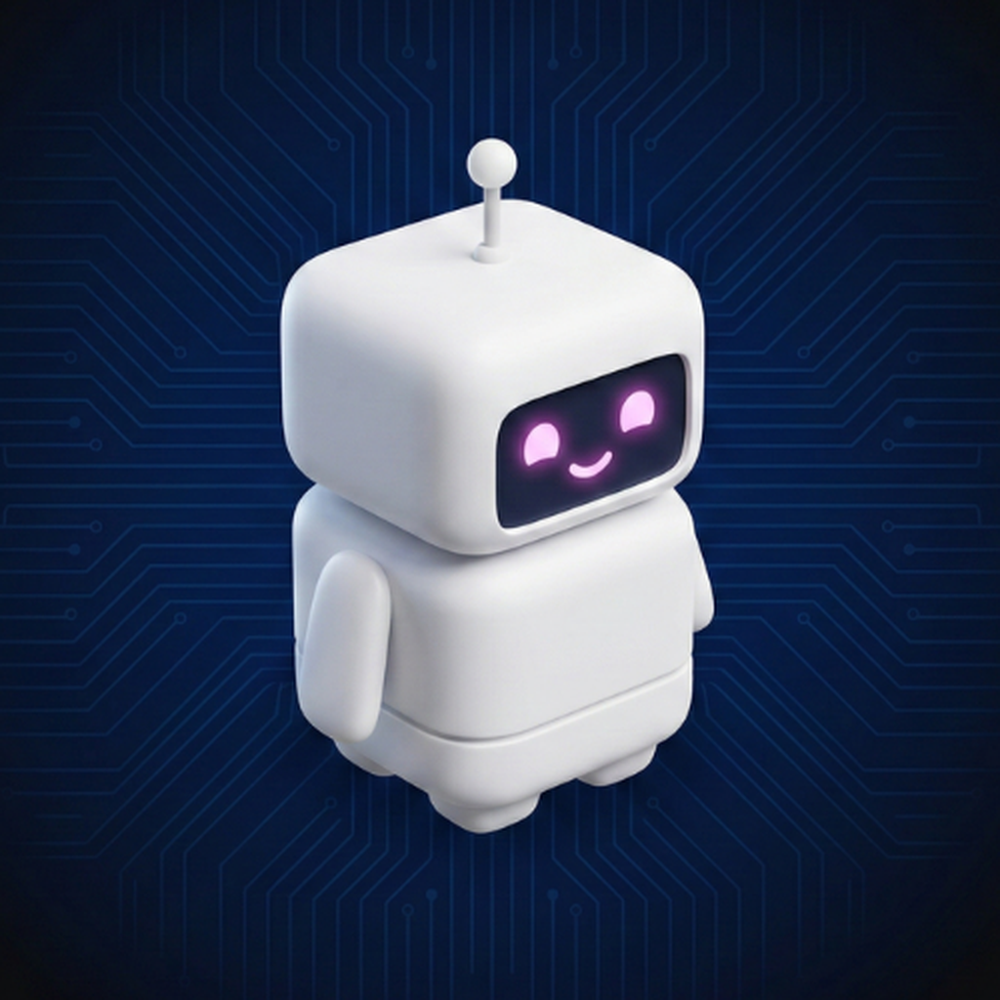
</p>

# Ping

## A Narrative Journey Through the Internet

Ping is an interactive 3D educational game built for iPad where you become a tiny data packet and travel across the internet. You start inside a smartphone, pass through routers and firewalls, ride undersea fiber optic cables, visit a DNS server, and rush back home to deliver the data the user requested. Along the way, you learn real computer networking concepts like TCP/IP, encryption, DNS, and routing through gameplay instead of textbooks.

Built entirely with Swift using SwiftUI, SceneKit, AVFoundation, and UIKit. Every 3D environment is generated from code using basic geometry. There are no imported 3D model files anywhere in the project.

Submitted for the Apple Swift Student Challenge '26.

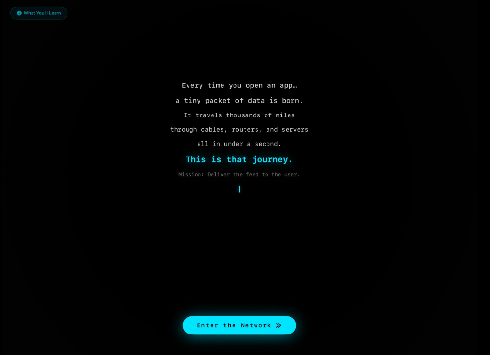

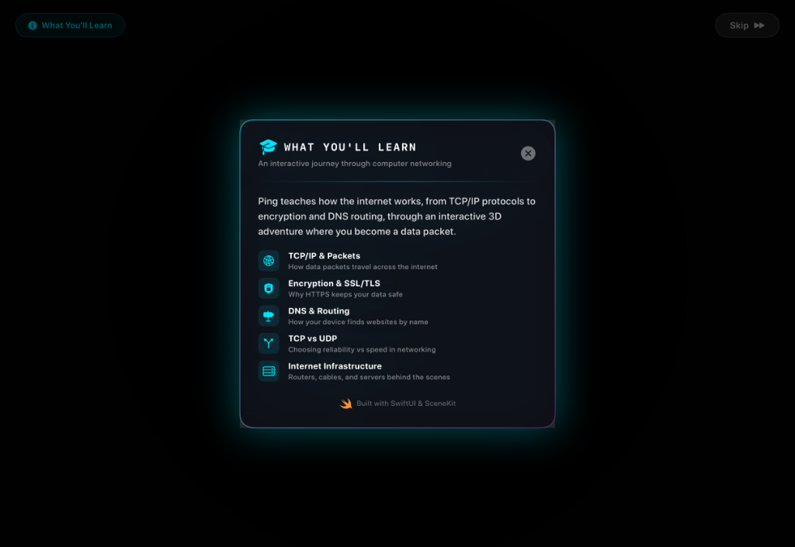

---

## Table of Contents

- [The Problem and Inspiration](#the-problem-and-inspiration)
- [Who Is This For](#who-is-this-for)
- [What You Learn](#what-you-learn)
- [How the Game Works](#how-the-game-works)
- [File Structure](#file-structure)
- [Accessibility](#accessibility)
- [The Six Game Levels](#the-six-game-levels)
- [How Networking Concepts Are Taught](#how-networking-concepts-are-taught)
- [Build and Run](#build-and-run)

---

## The Problem and Inspiration

In the 5th semester of college, the Computer Networks course immediately sparked interest. The way data travels across the world in milliseconds, how a simple tap on a phone triggers a chain reaction through routers, cables, and servers was fascinating. But the course was almost entirely theory based and the lab tools like Cisco Packet Tracer felt outdated. It was possible to memorize that DNS translates domain names to IP addresses, but it was not possible to see it happening. There was no way to visualize what it is like for a packet to travel thousands of miles and get back in the blink of an eye.

That is when the idea came to build an app to help visualize and learn computer network concepts. Ping is that app. You become a data packet, travel across the world to find the data you need, and return back. Along the way, you collect real networking concepts, make decisions that have consequences, and take quizzes to test what you just learned.

Ping was built because it should have existed when students sit in a classroom trying to imagine how the internet actually works.

---

## Who Is This For

Ping is for students, but not only college students or those studying engineering. It is also for school students, teachers, and anyone who has an interest in technology.

**College students studying computer networks** can actually see what they are memorizing. Walking through the network layers and making real choices turns passive reading into an active learning experience.

**School students** use the internet every day but rarely understand what happens behind the screen. Ping introduces complex topics like DNS and encryption through a fun game instead of boring textbooks. A curious school student can play Ping and finally understand why their passwords are safe or why a video call freezes.

**Curious adults** can play too because no prior knowledge is needed. You start as a tiny data packet, and the game teaches you everything you need to know along the way.

Ping makes the internet easy to understand for absolutely everyone.

---

## What You Learn

The game covers these core computer networking topics:

| Topic | What You Learn |
|-------|---------------|
| TCP/IP and Packets | How data packets travel across the internet |
| Encryption and SSL/TLS | Why HTTPS keeps your data safe |
| DNS and Routing | How your device finds websites by name |
| TCP vs UDP | Choosing reliability versus speed in networking |
| Internet Infrastructure | Routers, cables, and servers behind the scenes |

By the end of the game you will have collected up to 14 encyclopedia terms covering Daemons, Packets, DNS, IP Addresses, TCP, UDP, Routers, Firewalls, Latency, Fiber Optic Cables, Packet Headers, Payloads, HTTPS/SSL, and Encryption.

---

## How the Game Works

The game follows a five act story structure:

1. **Prologue** - A cinematic text sequence introduces the concept. You learn that every time you open an app, a tiny packet of data is born. You tap "Enter the Network" to begin.

2. **Act 1: CPU City** - You spawn as a small robot character inside the CPU. You meet a Daemon (a background process) who gives you your mission: travel to the DNS Server to look up the IP address for socialmedia.com and bring it back. The Daemon loads your packet layers with the request data.

3. **Act 2: Wi-Fi Antenna and Router Station** - You pass through the Firewall, which blocks you until you equip SSL encryption. Then you visit the Router, which reads your destination header and asks you to choose between TCP (reliable but slower) and UDP (fast but risky). This choice affects what happens later.

4. **Act 3: Ocean Floor** - You travel through an undersea fiber optic cable. Midway through, signal degradation occurs. If you chose TCP, your data is automatically recovered. If you chose UDP, some data is lost permanently. You experience the real consequences of your protocol choice.

5. **Act 4: DNS Library** - You arrive at the DNS Server, designed as a grand library. The DNS Librarian looks up the IP address for socialmedia.com (142.250.185.78) and writes it into your packet header.

6. **Act 5: The Return** - You rush back through heavy network traffic with the IP address. A Load Balancer routes you through an express channel to avoid congestion.

7. **Epilogue** - Mission complete. The feed loads. You see your journey stats, quiz accuracy, terms collected, and a summary of the choices you made.

Between each level, a quiz tests what you just learned. Getting questions right or wrong does not block progress, but your accuracy is tracked and shown at the end.

---

## Technology Stack

The app uses four Apple frameworks:

### SwiftUI
The primary framework for building the user interface. All menus, dialogue boxes, quiz overlays, HUD elements, the joystick, the encyclopedia, and the prologue/epilogue screens are built with SwiftUI views. SwiftUI handles layout, animation, state management, and accessibility features.

### SceneKit
Used to build the entire 3D world. SceneKit was chosen because it allows building 3D environments entirely in code without importing heavy 3D model files. Every building, character, portal, cable, and particle is generated programmatically using basic SceneKit geometry classes like SCNBox, SCNSphere, SCNTorus, and SCNCylinder. SceneKit also provides the HDR camera with bloom effects that create the glowing neon cyberpunk visual style. The 3D world renders behind the SwiftUI interface, and both layers compose together seamlessly.

### AVFoundation
Handles all audio in the app. AVAudioPlayer is used to loop different background music tracks for different levels and to play sound effects like the typewriter dialogue sound and achievement chimes. The audio session is configured with the ambient category, which means it respects the device silent switch. This makes the app safe to use in a classroom setting.

### UIKit
Used for a few important features that SwiftUI cannot handle on its own:
- UIFontMetrics provides Dynamic Type scaling so all text respects the user's preferred font size setting.
- UIImpactFeedbackGenerator and UINotificationFeedbackGenerator power the physical haptic vibrations throughout the app. The joystick, buttons, dialogue typing, quiz answers, and portal transitions all have distinct haptic feedback.
- UIApplicationDelegate and UIWindowScene lock the screen to landscape orientation.

---

## File Structure

```
Ping/
  PingApp.swift
  ContentView.swift
  Engine/
    GameEngine.swift
    SceneManager.swift
    WorldBuilder.swift
    SoundManager.swift
  Models/
    GameModels.swift
  Views/
    PrologueView.swift
    ExplorationView3D.swift
    EpilogueView.swift
    PauseMenuView.swift
  Components/
    DialogueView.swift
    JoystickView.swift
    QuizView.swift
    EncyclopediaView.swift
    CyberpunkTheme.swift
    AccessibilityFonts.swift
  Sounds/
    cyber_bgm.mp3
    underwater_hum.mp3
    typewriter.mp3
    achievement.mp3
    error.mp3
  Assets.xcassets/
```

---

## Accessibility

Accessibility was treated as a priority, not an afterthought.

**VoiceOver support.** Every interactive element has accessibility labels and hints. Buttons describe what they do. The dialogue box reads the full text of each line. Progress indicators announce their state. Decorative elements are hidden from VoiceOver. HUD elements are properly identified as headers and buttons.

**Dynamic Type.** Every text element in the app scales with the user's preferred font size setting using UIFontMetrics. The text caps at 1.5 times the base size to prevent the game HUD from breaking at extreme sizes.

**Motor accessibility.** The interaction radius for NPCs and portals is deliberately generous. Players do not need pixel-perfect positioning to trigger conversations or enter portals.

**Cognitive clarity.** Bouncing quest markers float above NPCs who need to be talked to. Tutorial tooltips cycle through helpful messages during the first 12 seconds of gameplay. Locked portal messages clearly tell the player who they need to talk to.

---

## The Six Game Levels

### 1. CPU City

The first level represents the inside of a smartphone's CPU. The environment is a dark digital cityscape with towering server monolith buildings lining corridors. The floor is a highly reflective dark glass surface with embedded cyan grid dots that fade toward the edges, creating a circuit-board feel. Hexagonal accent patches on the floor add visual variety. Data stream lanes run across the floor as glowing rails with animated pulses sliding along them. Floating wireframe cubes rotate slowly in the air. The lighting uses three colored spotlights: cyan from the front-left, magenta from the right, and violet from behind.

The player meets a Daemon NPC who explains that a user just tapped "Load Feed" and a packet needs to be sent to find the IP address for socialmedia.com.

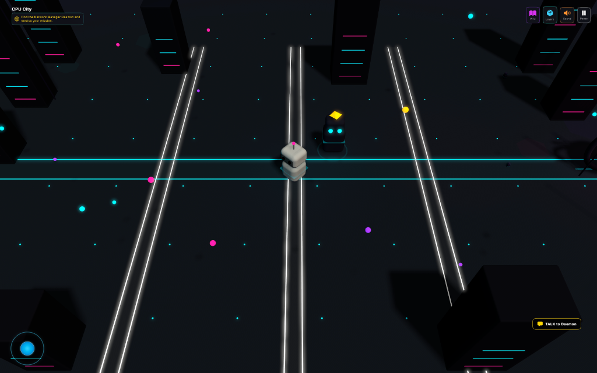

### 2. Wi-Fi Antenna

This level is an industrial rooftop with a massive broadcast antenna tower at the center. The antenna is built from multiple cylindrical sections (base, lower, mid, upper) with cross-arms at mid height, support struts, and a glowing sphere at the tip. WiFi signal wave rings (torus shapes) pulse outward from the antenna tip, expanding and fading in a staggered pattern. Satellite dishes with receiver arms dot the rooftop. Signal strength indicator bars cascade in blinking patterns. Elevated catwalks with railing posts ring the antenna. Cable conduits run across the floor and overhead.

The player meets the Firewall who blocks passage until SSL encryption is equipped through the inventory swap puzzle.

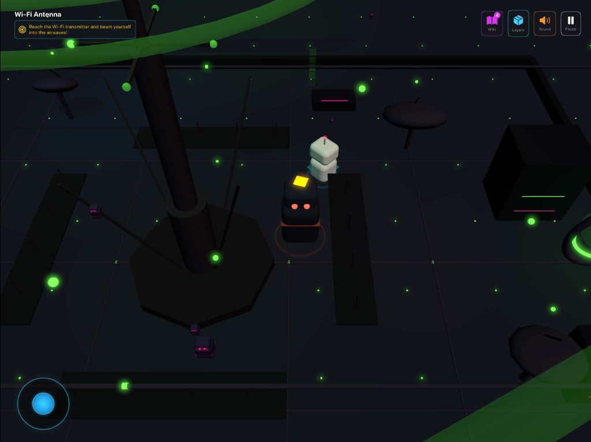

### 3. Router Station

Designed as an underground subway station. Track rails glow with amber light. Platform pillars made of thick metallic cylinders line both sides. Overhead pipes run along the ceiling. Back walls close off the sides. Glowing spheres representing data trains race along the rails. Neon direction signs hang on the walls. The lighting is warm amber with boosted spot lights from the ceiling and omni lights between pillars.

The player meets the Router who explains packet forwarding and offers the choice between TCP and UDP.

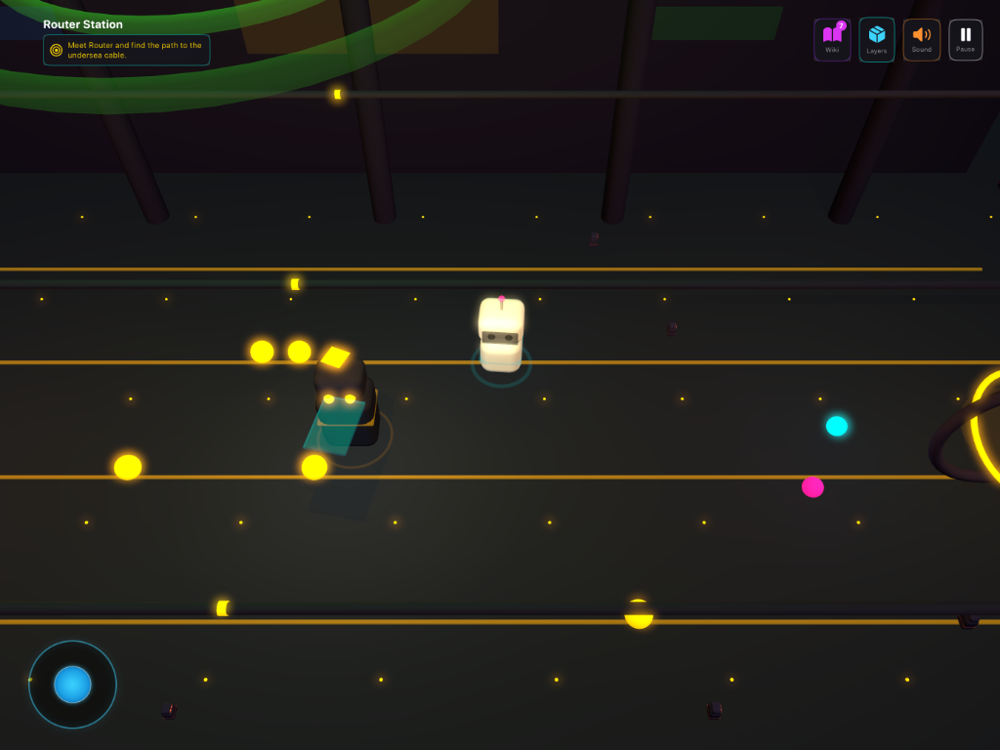

### 4. Ocean Floor Cable

The player travels inside a long fiber optic cable stretched across the ocean floor. The cable is a glass cylinder made from a translucent SCNCylinder with a hexagonal wireframe overlay. Inside, a walkway provides the surface to walk on with glowing center and side stripes. Data pulse spheres race through the cable. Outside the cable, the environment features bioluminescent deep-sea elements including kelp forests, coral formations, jellyfish shapes, bubble columns, and manta ray silhouettes. The sky is a deep blue gradient and the ambient sound switches to an underwater hum.

During this level, signal degradation triggers a system message that plays out differently depending on the TCP/UDP choice.

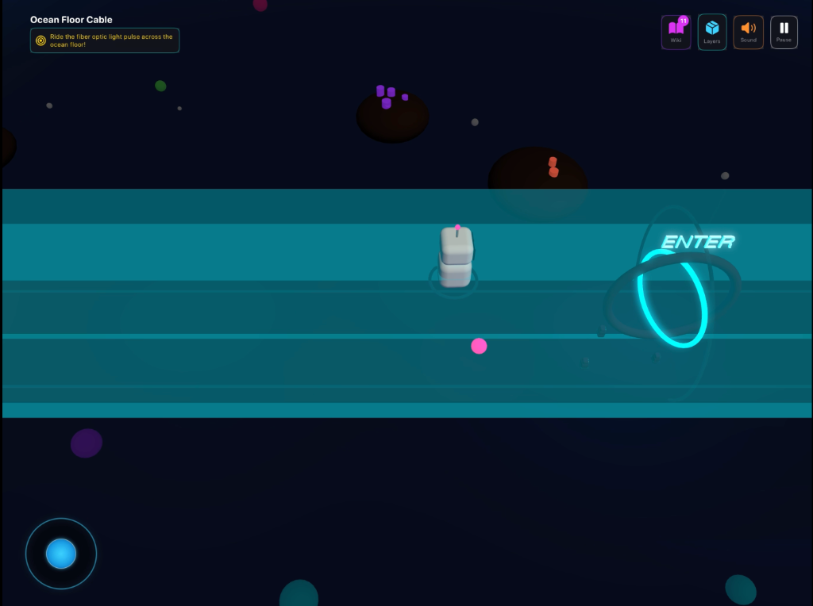

### 5. DNS Library

A grand cathedral-like library. The centerpiece is a knowledge tree made from a cylindrical trunk with sphere and torus canopy elements covered in glowing leaves. Towering bookshelf walls line the sides, built from SCNBox shapes stacked in rows with colored spines. Floating holographic data panels hover in the air. Reading desks have glowing text surfaces. Crystal data pillars stand around the space. The lighting uses violet and magenta tones to create a mystical atmosphere.

The player meets the DNS Librarian who resolves socialmedia.com to IP address 142.250.185.78.

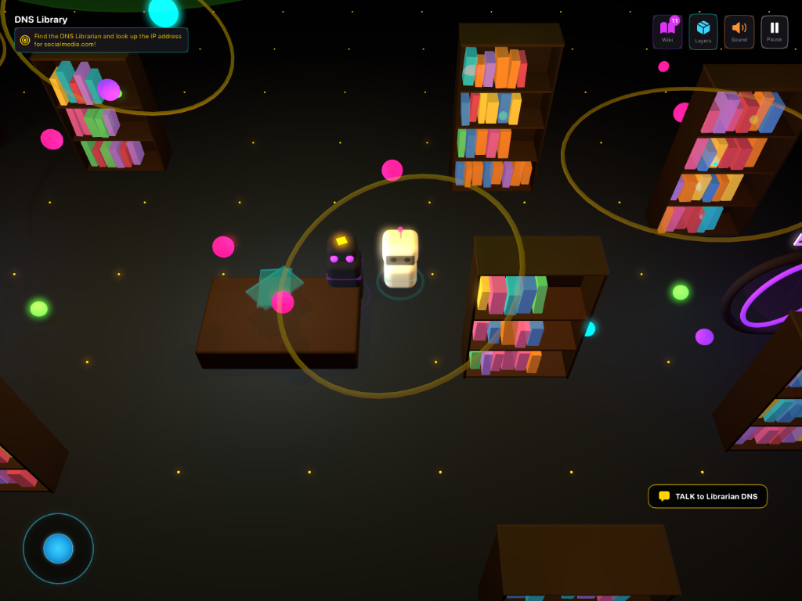

### 6. Return Journey

The final level creates urgency with a warm coral/red color palette. Network congestion is visualized through red warning lights, traffic cone shapes, warning beacons, and a congested data lane with red flashing pulses. Floating error cubes tumble through the air. The accent color shifts to coral to communicate the time pressure of getting the response back before the connection times out.

The player meets a Load Balancer who routes them through an express channel.

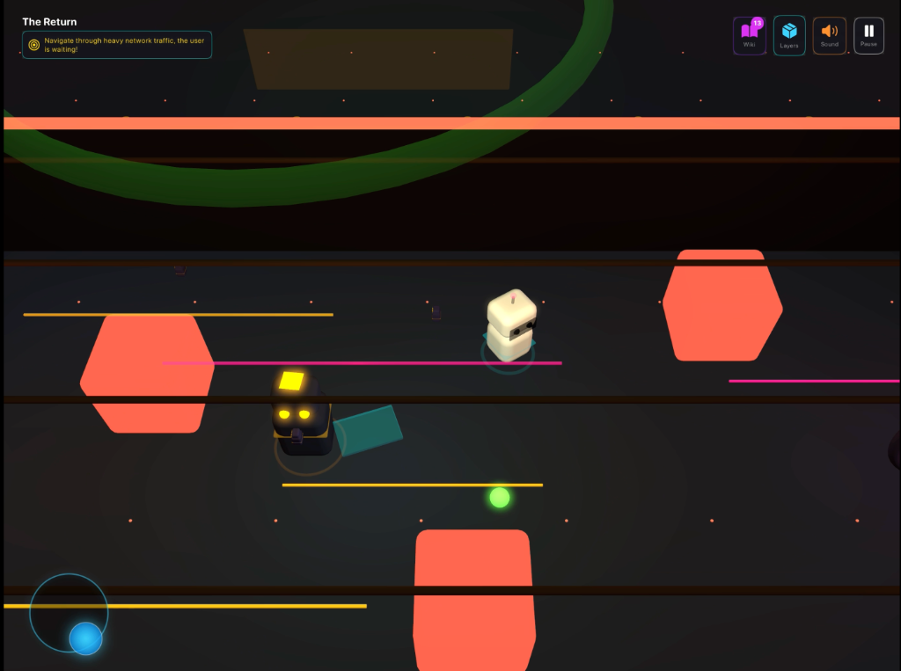

---

## How Networking Concepts Are Taught

The game teaches through three integrated methods:

**Narrative dialogue.** NPCs explain concepts in conversational language. The Daemon explains what a daemon is. The Firewall explains encryption. The Router explains routing. This is not dry textbook language. It is written as character dialogue that makes the concepts memorable.

**Player choices with consequences.** The TCP versus UDP choice at the Router Station directly affects what happens in the Ocean Cable level. If you chose TCP, lost data is automatically retransmitted. If you chose UDP, the data is gone forever. You do not just read about the difference. You experience it.

**Quizzes with explanations.** After each level, quiz questions test comprehension. Each question has four options and a detailed explanation shown after answering. This reinforces the concepts you just encountered.

**Encyclopedia collection.** Terms are collected passively during dialogue. Players can review them at any time. Each term includes a real-world fact (like "over 95% of intercontinental data travels through undersea cables") to ground the game concepts in reality.

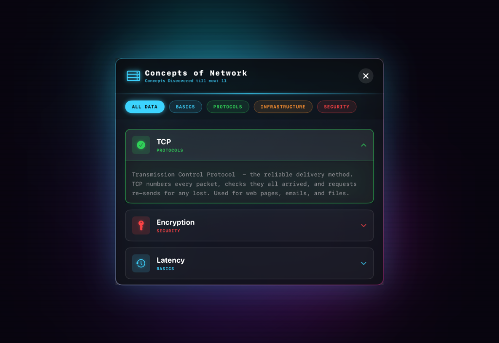

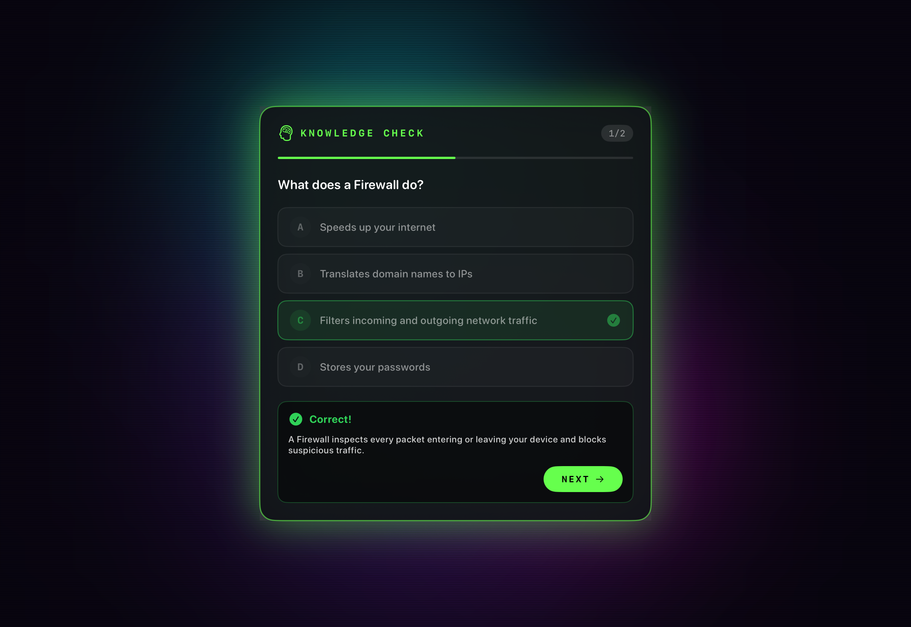

---

## Build and Run

### Requirements
- Xcode (latest version recommended)
- iPad or iPad Simulator
- iOS deployment target as specified in the project settings

### Steps
1. Open Ping.xcodeproj in Xcode.
2. Select an iPad simulator or a connected iPad device.
3. Build and run.

The app is designed for iPad in landscape orientation. It will automatically lock to landscape when launched.

No external dependencies are required. Everything is built using Apple's built-in frameworks.
